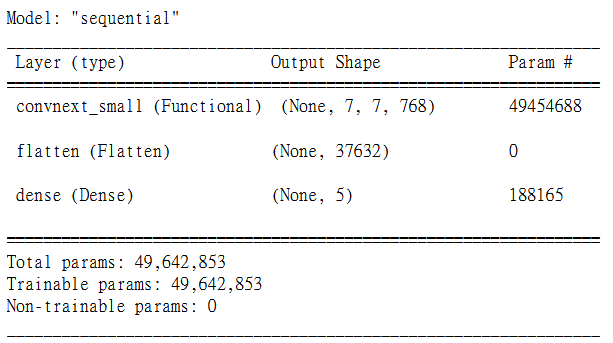
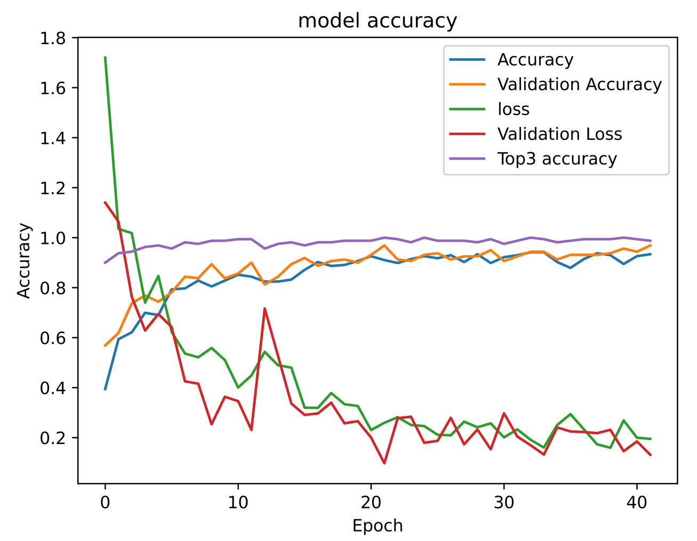
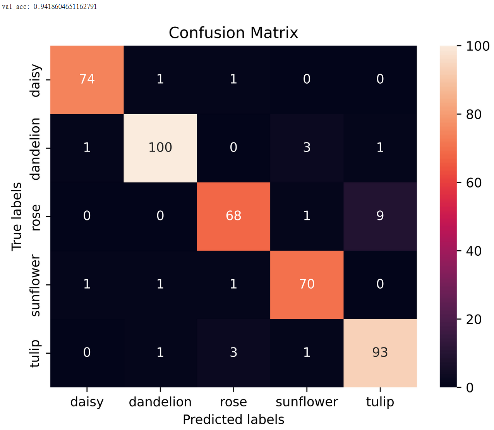
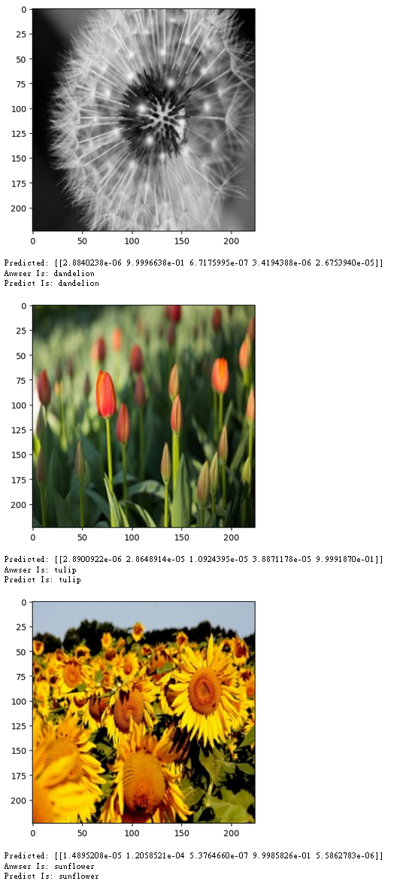
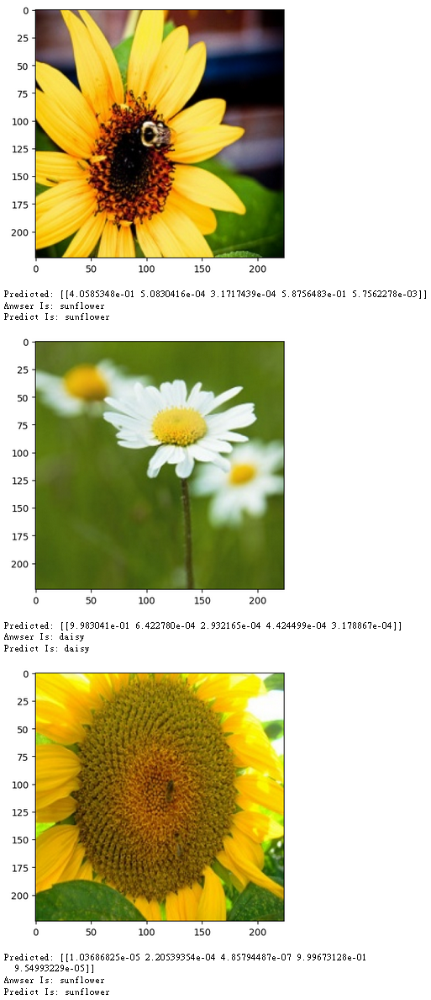
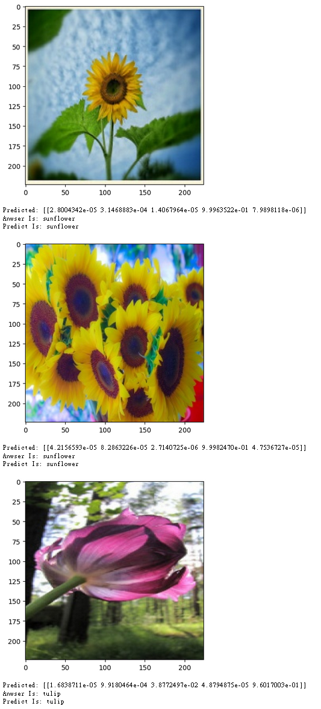
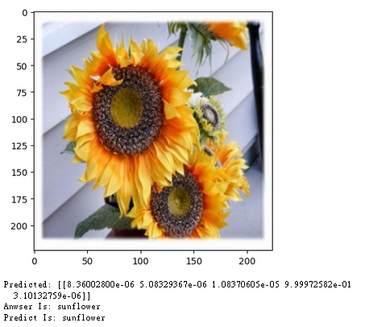

# ConvNeXtSmall進行遷移學習的花朵辨識神經網路
這是一個jupyter專案，檔名為train2，<br />
能將flowers資料夾內的檔案，<br />
以9:1的方式分為訓練集(3887張)與測試集(430張)，<br />
再使用Keras提供的預訓練ConvNeXtSmall模型進行微調，<br />
ConvNeXt是一種新型的卷積神經網絡架構，由Facebook AI團隊在2017年提出。<br/>
使用了可變的卷積核大小和跨度，以及跨類別的融合方式，可以在保持高效率的同時提高模型的表現。<br/>
相比於VGG16，ConvNeXt在同樣的參數量和訓練資料下能夠取得更好的結果，<br/>
本次實驗由於使用遷移學習，準確度也有更大的提升。<br/>
程式在載入圖片時會進行Data Augmentation，<br />
且有設定checkPoint及earlyStopping，<br />
訓練之後能載入模型，並進行辨識，<br />
### *需要tensorflow 2.11.0

## 資料夾結構
[下載ConvNeXtSmall.h5](https://drive.google.com/file/d/1J9w7fvUxrf2JPr6I2MLe7P7vR0afTe1W/view?usp=share_link)
```
.
├── ...
├── train2.ipynb          # jupyter專案
├── flowers               # 原始資料集
│   ├── daisy
│   ├── dandelion
│   └── ...
├── train                 # jupyter輸出訓練集
│   ├── daisy
│   ├── dandelion
│   └── ...
├── validation            # jupyter輸出測試集
│   ├── daisy
│   ├── dandelion
│   └── ...
├── ConvNeXtSmall.h5      # 我訓練的網路
└── ...
```
## 網路結構
<p align="left">
    
    <br/>
</p>

## 訓練結果
<br />
Best Epoch: 22<br /><br />
loss: 0.2591<br />
accuracy: 0.9102<br />
top_3_categorical_accuracy: 0.9961<br />
<br />
val_loss: 0.0973<br />
val_accuracy: 0.9688<br />
val_top_3_categorical_accuracy: 1.0<br />
<p align="left" style="background-color:white;">
    
    <br/>
</p>

### Base on epoch: 22
<p align="left" style="background-color:white;">
    
    <br/>
</p>

## 辨識結果
<p align="left" style="background-color:white;">
    
    <br/>
    
    <br/>
    
    <br/>
    
    <br/>
</p>

## 結論
由於改用ConvNeXt並且使用遷移學習，準確度較上次有很大的提升。<br/>
而從混淆矩陣中可以看出，模型較容易將玫瑰誤認為鬱金香，<br/>
可能是由於兩者花型較為相似，比較容易誤判，<br/>
並且從辨識結果可以發現，黃色的玫瑰更容易被辨識為鬱金香，<br/>
推測是因為訓練集內紅玫瑰較常見，且黃色在鬱金香較普遍，
因此在混淆矩陣中較少有鬱金香辨識為玫瑰。


# 基於VGG16的花朵辨識神經網路
這是一個jupyter專案，檔名為train，<br />
能將flowers資料夾內的檔案，<br />
以9:1的方式分為訓練集(3887張)與測試集(430張)，<br />
再使用Keras建立VGG16的模型，並且加入兩層Dropout，<br />
在載入圖片時會進行Data Augmentation，<br />
且有設定checkPoint及earlyStopping，<br />
訓練之後能載入模型，並進行辨識，<br />
雖然參數較龐大，但還是能有很好的表現。

## 資料夾結構
[下載vgg16_0.85625.h5](https://drive.google.com/file/d/1bdblo4Msab4FRrOV4HzZqTLYTyFnWfQg/view?usp=share_link)
```
.
├── ...
├── train.ipynb           # jupyter專案
├── flowers               # 原始資料集
│   ├── daisy
│   ├── dandelion
│   └── ...
├── train                 # jupyter輸出訓練集
│   ├── daisy
│   ├── dandelion
│   └── ...
├── validation            # jupyter輸出測試集
│   ├── daisy
│   ├── dandelion
│   └── ...
├── vgg16_0.85625.h5      # 我訓練的網路
└── ...
```
## 網路結構
<p align="left">
    
    <br/>
</p>

## 訓練結果
<br />
Best Epoch: 58<br /><br />
loss: 0.6834<br />
accuracy: 0.7383<br />
top_k_categorical_accuracy: 0.9668<br />
<br />
val_loss: 0.4361<br />
val_accuracy: 0.8562<br />
val_top_k_categorical_accuracy: 0.9875<br />
<p align="left" style="background-color:white;">
    
    <br/>
</p>

## 辨識結果
<p align="left" style="background-color:white;">
    
    <br/>
    
    <br/>
    
    <br/>
    
    <br/>
</p>
