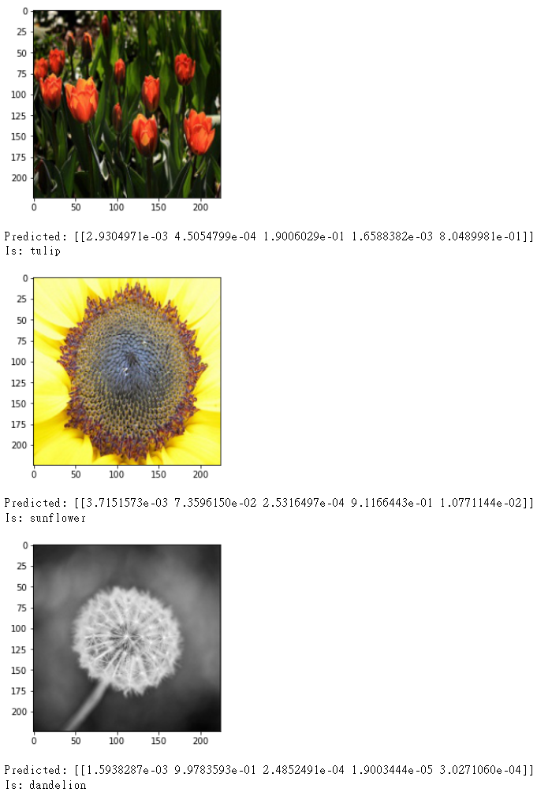

# 基於VGG16的花朵辨識神經網路
這是一個jupyter專案，<br />
能將flowers資料夾內的檔案，<br />
以9:1的方式分為訓練集(3887張)與測試集(430張)，<br />
再使用Keras建立VGG16的模型，並且加入兩層Dropout，<br />
之後能載入模型，並進行辨識。

## 資料夾結構
[下載vgg16_0.85625.h5](https://drive.google.com/file/d/1bdblo4Msab4FRrOV4HzZqTLYTyFnWfQg/view?usp=share_link)
```
.
├── ...
├── train.ipynb           # jupyter專案
├── flowers               # 原始資料集
│   ├── daisy
│   ├── dandelion
│   └── ...
├── train                 # jupyter輸出訓練集
│   ├── daisy
│   ├── dandelion
│   └── ...
├── validation            # jupyter輸出測試集
│   ├── daisy
│   ├── dandelion
│   └── ...
├── vgg16_0.85625.h5      # 我訓練的網路
└── ...
```
## 網路結構
<p align="left">
    
    <br/>
</p>

## 訓練結果
<br />
Best Epoch: 58<br /><br />
loss: 0.6834<br />
accuracy: 0.7383<br />
top_k_categorical_accuracy: 0.9668<br />
<br />
val_loss: 0.4361<br />
val_accuracy: 0.8562<br />
val_top_k_categorical_accuracy: 0.9875<br />
<p align="left" style="background-color:white;">
    
    <br/>
</p>

## 辨識結果
<p align="left" style="background-color:white;">
    
    <br/>
    
    <br/>
    
    <br/>
    
    <br/>
</p>
