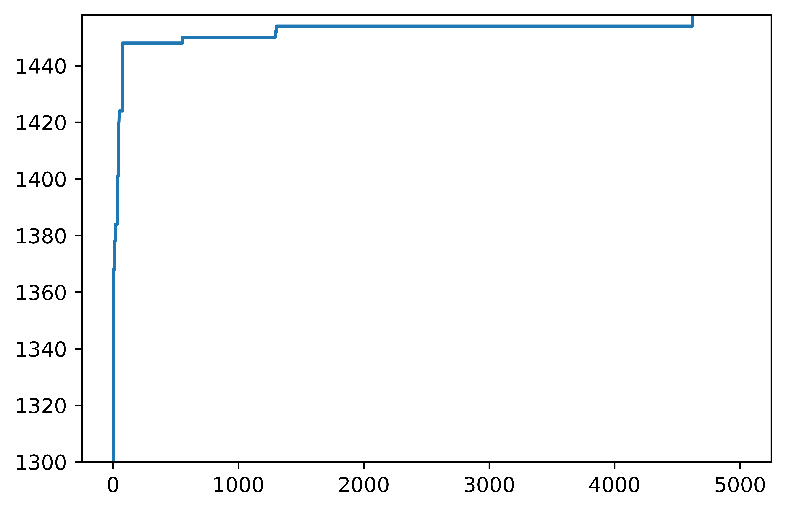
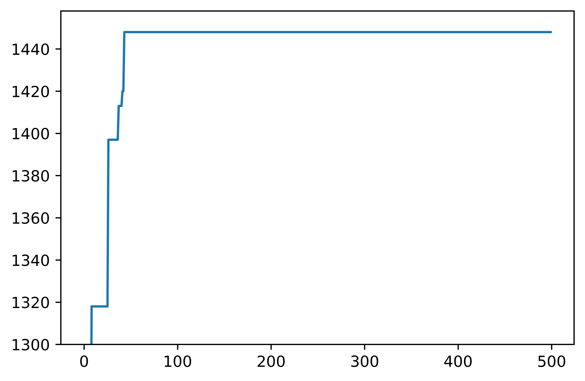

# 爬山演算法

這是一個jupyter專案，能以爬山演算法解 0/1 背包問題，<br />
初始解會隨機在背包中放入兩個物品，<br />
之後每次迭代隨機將一個物品放入後，會檢查是否比當前最佳解更為優秀，<br />
如果成立便會替換成為當前最佳解，不成立則會取出剛放入的物品並額外隨機取出另一個，<br />
如果超重也會取出剛放入的物品並額外隨機取出另一個，<br />
直到500次迭代後，輸出結果。<br />

## 輸出結果

```
[1, 0, 1, 0, 1, 0, 1, 1, 1, 0, 0, 0, 0, 1, 1]
1458
```
## 收斂圖

<p align="left" style="background-color:white;">
    
    <br/>
</p>

# 模擬退火演算法

這是一個jupyter專案，能以模擬退火演算法解 0/1 背包問題，<br />
初始會隨機選擇一個物品，並改變它的放入狀態，<br />
計算物品是否超重，若超重則恢復到上一步，<br />
否則檢查這個解是否是當前最佳解，<br />
如果成立便會替換成為當前最佳解，<br />
接下來根據溫度和解的價值差，決定是否接受解，<br />
最後對溫度T進行降溫，<br />
直到500次迭代後，輸出結果。<br /><br />

很遺憾退火演算法一直沒辦法抵達正確答案，<br />
經過多次的參數調整後也是如此，目前還無法找出問題點<br />
也許未來有更多知識儲備，方能了解問題所在。


## 輸出結果

```
[0, 1, 1, 1, 0, 0, 1, 1, 1, 0, 0, 0, 0, 1, 1]
1456
```
## 收斂圖

<p align="left" style="background-color:white;">
    
    <br/>
</p>
