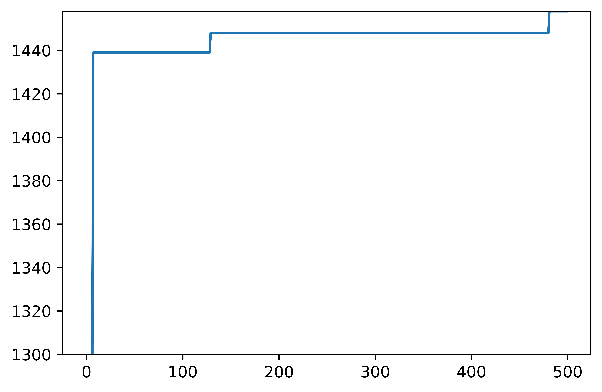

# 爬山演算法

這是一個jupyter專案，能以爬山演算法解 0/1 背包問題，<br />
初始解會隨機在背包中放入兩個物品，<br />
之後每次迭代隨機將一個物品放入後，會檢查是否比當前最佳解更為優秀，<br />
如果成立便會替換成為當前最佳解，不成立則會取出剛放入的物品並額外隨機取出另一個，<br />
如果超重也會取出剛放入的物品並額外隨機取出另一個，<br />
直到500次迭代後，輸出結果。<br />

## 輸出結果

```
[1, 0, 1, 0, 1, 0, 1, 1, 1, 0, 0, 0, 0, 1, 1]
1458
```
## 收斂圖

<p align="left" style="background-color:white;">
    
    <br/>
</p>

# 模擬退火演算法

這是一個jupyter專案，能以模擬退火演算法解 0/1 背包問題，<br />
初始背包為一個空背包，<br />
每次迭代會隨機選擇一個物品，並改變它的放入狀態，<br />
計算物品是否超重，若超重則恢復到上一步，<br />
否則檢查這個解是否優於之前的區域最佳解，<br />
如果成立便會替換成為當前區域最佳解，<br />
並檢查是否也優於之前的全域最佳解，來決定是否成為全域最佳解;<br />
如果本次迭代並沒有優於之前的區域最佳解，
就根據溫度和解的價值差，決定是否接受解，<br />
最後對溫度T進行降溫，<br />
直到500次迭代後，輸出結果。<br /><br />

## 錯誤修正
本次將區域最佳解與全域最佳解分開儲存，
修正了區域最佳解被當成全域最佳解的錯誤，<br />
並且改正了之前誤在p = np.exp(delta / T)的delta前加負號，
導致不管溫度如何都接受較差解的錯誤。


## 輸出結果

```
[1, 0, 1, 0, 1, 0, 1, 1, 1, 0, 0, 0, 0, 1, 1]
1458
```
## 收斂圖

<p align="left" style="background-color:white;">
    
    <br/>
</p>

### 1300~1458區間放大
<p align="left" style="background-color:white;">
    
    <br/>
</p>
